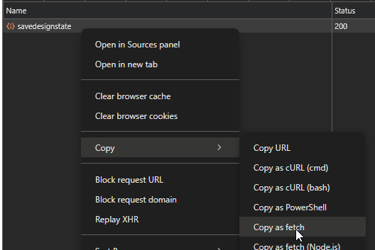
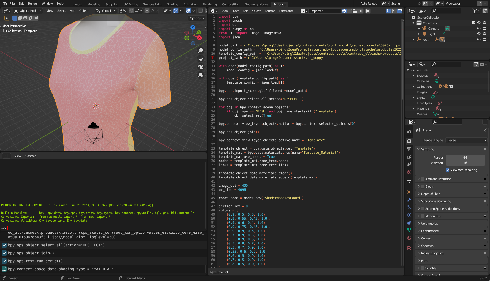
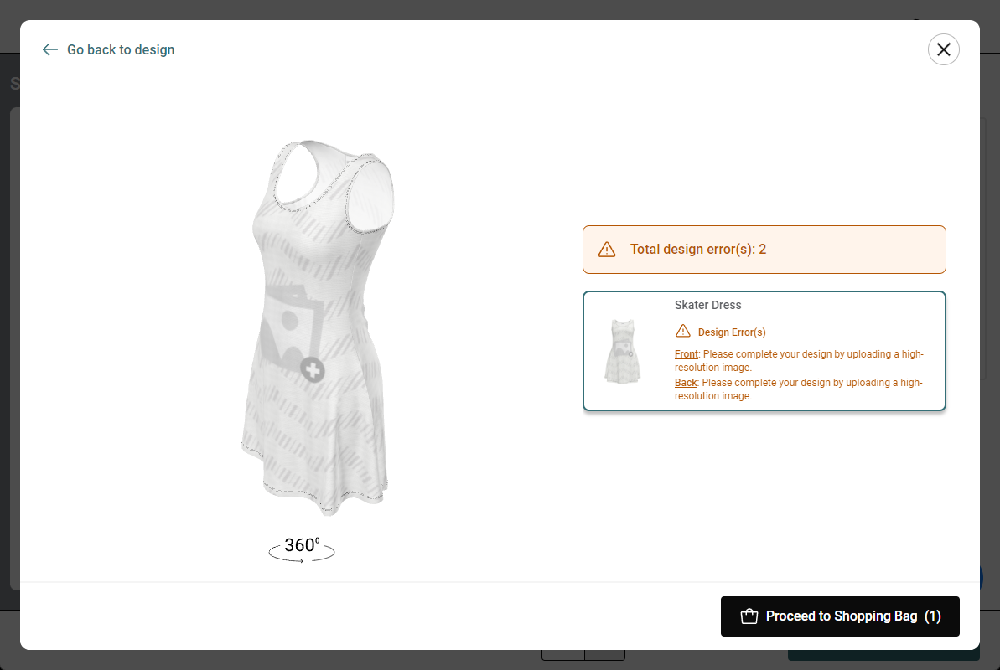
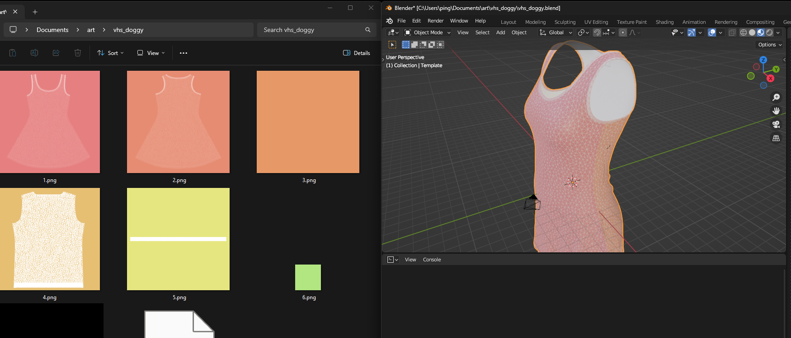
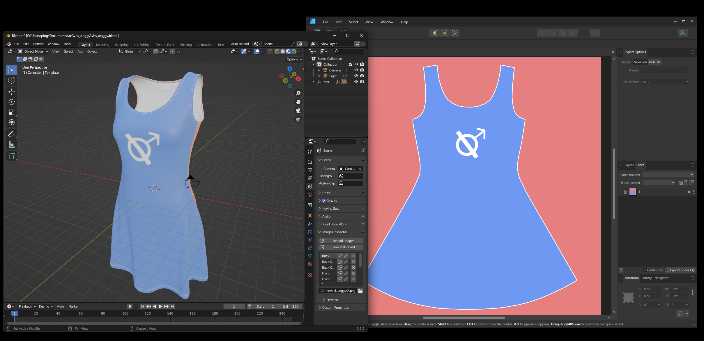
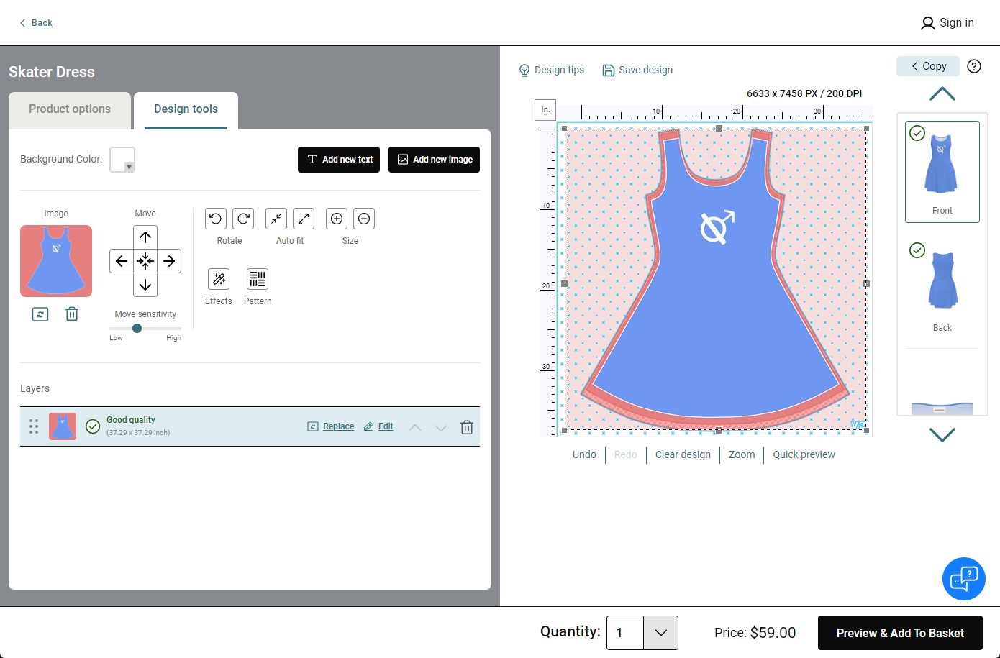
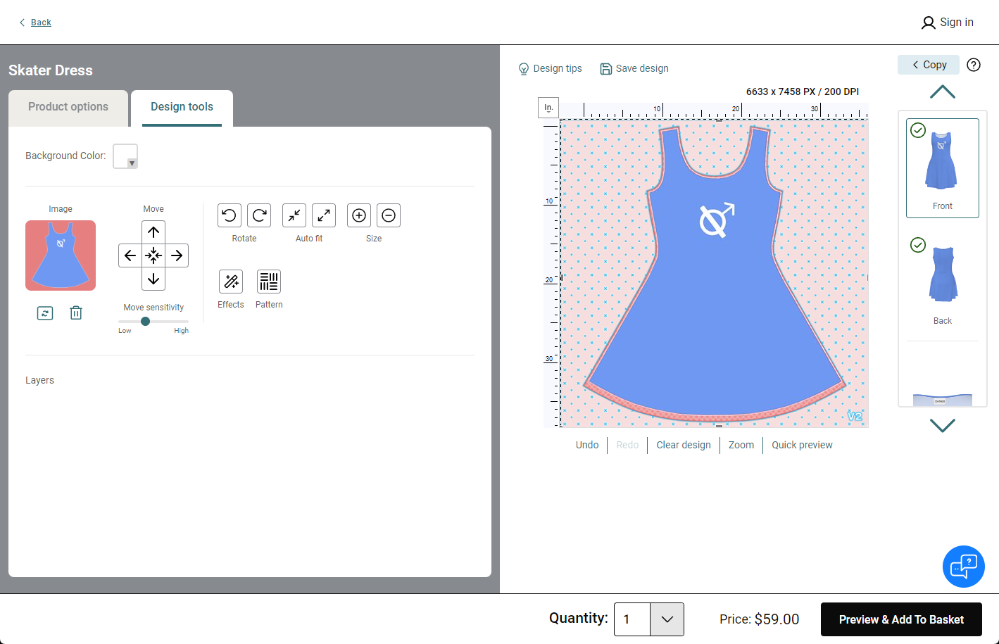
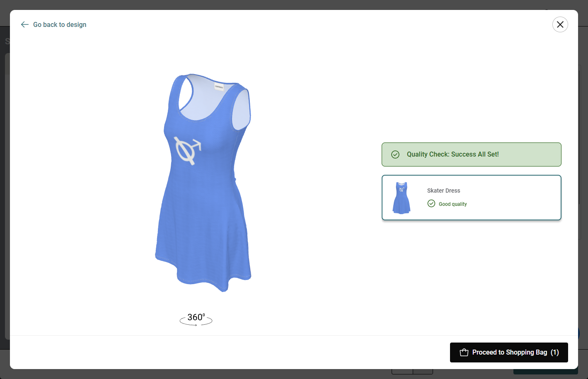
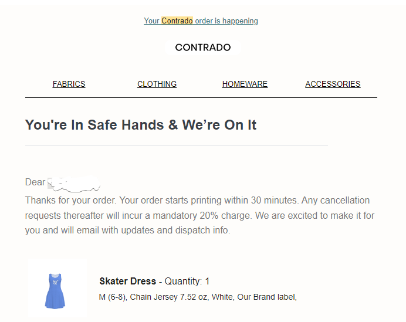

# Contrado Tools

This repository contains tools that can be used to scrape metadata
and 3d models from the [Contrado](https://www.contrado.com/) website.

Contrado is a print-on-demand service that allows users to upload their
own designs and have them printed on various products such as shirts,
dresses, and bags.

I created these tools to help me create designs using professional 3d
modelling and texturing software, otherwise, you would have to use
Contrado's online design tool which is quite limited and slow.

## Tools

### `contrado_dl/scrape.dart`

This script uses puppeteer to crawl the Contrado website for product IDs,
downloads the JSON metadata for each product/variant, and downloads the
actual glTF model files.

```
cache/links.txt - list of URLs that were crawled
cache/http/... - cached HTTP responses
cache/products/<id>/options.html - HTML form containing some settings, such as thread color
cache/products/<id>/model_config.json - Metadata containing the list of sizes and texture configuration
cache/products/<id>/<size>/template.json - Metadata containing texture/mask sizes
cache/products/<id>/<size>/<item>.glb - The actual model 
```

If you don't want to run it yourself you can check out [releases](https://github.com/pingbird/contrado-tools/releases).
Note that all of these assets are owned by Contrado and should not be
used for commercial purposes.

### `contrado_dl/mask_fix.dart`

This script positions and scales the mask so that they align correctly with
textures made for the model, this is necessary because the web UI does not
have any sort of alignment tool.

To use it, upload your textures to the correct patches of fabric in the
web UI (notice they are misaligned), go into the network tab of DevTools,
right-click the network request for `savedesignstate`, and click
`Copy > Copy as fetch`:



Paste this into `contrado/input.js` and run `mask_fix.dart`, it will
output a new `output.js` with a fetch request that contains the fixed
mask positions. Paste this into the DevTools console, refresh the page,
and your textures should now be aligned correctly, yay!

### `blender/importer.py`

This is a Blender script that can be used to import the downloaded models
into Blender. It uses the `model_config.json` and `template.json` files
to create separate textures for each patch of fabric, and positions them
correctly on the model with a shader. It also paints a nice wireframe for
each patch, so you can easily see the borders.

To use it, open Blender, go to the `Scripting` tab, create a new script,
paste the contents of `importer.py`, update the relevant paths, and run it.

Blender may freeze for a minute since it generates very high resolution
textures, if successful, you should see a colorful model with wireframes:



## Full workflow

### 1. Locate a product on the Contrado website

This must be a product that has a 3d model available, such as the
[Custom Skater Dress](https://www.contrado.com/custom-skater-dress).

Note the product ID in the design tool URL, in this case it's `1614`.

You can tell if a product has a 3d model by going into the design tool and
pressing the "Preview" button in the bottom right, you should have a 360
view:



### 2. Pick a size and extract the model

To get the assets, run `scrape.dart` or download them from the
[releases](https://github.com/pingbird/contrado-tools/releases).

Each size has a different model, so if you get the wrong size you will
have to re-design your textures. My measurements closely matched the
`M_10_12UK` size for the above dress, so I use that.

The relevant files are:

```
cache/products/1614/model_config.json
cache/products/1614/M_10_12UK/Skater_Dress.glb
cache/products/1614/M_10_12UK/template.json
```

### 3. Import model into Blender

As mentioned above, use the `importer.py` script to import the model
into Blender. You will need to update the paths in the script to point
to the correct files.

```python
model_path = r'C:\Users\ping\IdeaProjects\contrado-tools\contrado_dl\cache\products\1614\M_10_12UK\Skater_Dress.glb'
model_config_path = r'C:\Users\ping\IdeaProjects\contrado-tools\contrado_dl\cache\products\1614\model_config.json'
template_config_path = r'C:\Users\ping\IdeaProjects\contrado-tools\contrado_dl\cache\products\1614\M_10_12UK\template.json'
project_path = r'C:\Users\ping\Documents\art\vhs_doggy'
```

You should now have a model with correctly positioned textures, you should
also see a bunch of texture files in the project directory:



### 4. Design your textures

You can now design your textures in your favorite 2d software, such as
Photoshop, Affinity Designer, or GIMP. You can use the wireframes as a
guide to where the patches are.

To re-import the textures back into blender, I highly recommend installing
the [Auto Reload Plugin](https://github.com/samytichadou/Auto_Reload_Blender_addon),
this will automatically reload the textures when you save them in your image
editor.



My design has the logo of like... a band or something. :-)

### 5. Upload textures

In the design tool, click each patch of fabric and upload the corresponding
texture:



You may notice that the textures are misaligned, this is where the
`mask_fix.dart` script comes in. Follow the instructions above to fix
the mask positions:



### 6. Profit

You should now have a beautiful dress with your own custom design!!!



